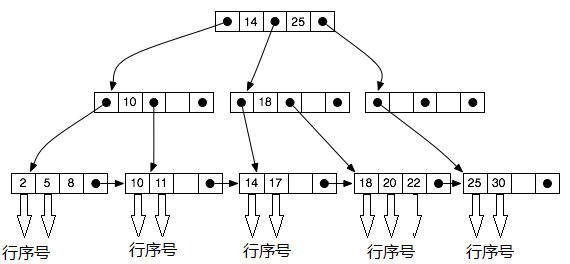

## B Plus Tree
### 总述
B Plus Tree实现了封装的B+Tree数据结构，是一个n叉排序树，每个节点有多个孩子，一棵B+树包含根节点、内部节点和叶子节点。根节点可能是一个叶子节点，也可能是一个包含两个或两个以上孩子节点的节点。
本模块为index manager提供了b plus tree数据结构，提供方便的查询、插入、删除操作
### 主要功能接口
#### `bulkload`
- 本函数被调用于create index语句之中，其具体作用是为index文件创建一个B+Tree的变量，并且会将传入的数组批量插入至B+Tree之中
- 传入参数
  - 待转化数组
  - order的大小
- 返回结果
  - B+Tree 对象
#### `get`
- 本函数被调用于select语句之中，其具体作用为返回B+Tree某个节点(key)所对应的键值(value)
- 传入参数
  - key，即某个表中的某行中的某个字段的值
返回结果
  - value，即这一行所在的行序号
#### `insert`
- 本函数被调用于insert语句之中，其具体作用为插入某个表中的某行中的某个字段的值和其对应的行序号，以便于以后的查找
- 传入参数
  - key，即某个表中的某行中的某个字段的值
  - value，即这一行所在的行序号
- 返回结果
  - 创建成功与否
#### `delete`
- 本函数被调用于delete语句之中，其具体作用为删除B+Tree中的某个键和其所对应的值
- 传入参数
  - key，即某个表中的某行中的某个字段的值
- 返回结果
  - 删除成功与否
### 数据结构
B+Tree有以下性质
- 非叶子结点的子树指针与关键字个数相同
- 非叶子结点的子树指针P[i]，指向关键字值属于[K[i], K[i+1])的子树（B-树是开区间）
- 为所有叶子结点增加一个链指针
- 所有关键字都在叶子结点出现
- 由于限制了除根结点以外的非叶子结点，至少含有M/2个儿子，确保了结点的至少利用率，其查找、插入、删除操作的时间复杂度均为O(logN)
在本模块之中，叶子结点内容为即某个表中的某行中的某个字段的值。叶子结点的链指针指向该行记录在文件中的位置，具体实现为记录该行的行序号，由于数据为定长存储，根据行序号即可计算得其在文件的具体位置。

额外说明：
- 本模块实现的b+Tree为内存中实现，因此在设计的过程中，没有固定每个节点的大小恰好为一个BLOCK的大小。
- 本模块的B+Tree为纯python实现，相比于同等水平的c++实现代码，更为简单，代码量较小，但是速度有劣势
- 在本实验的要求的数据量下，经过测试，这些速度劣势完全不可感知。
### 实现思路及算法
#### `bulkload`
给定一组数据记录，我们要在一些关键字段上创建一个B +树索引。 一种方法是将每个记录插入一个空树。 然而这种做法耗时更长，代价更大，因为每个条目都要求我们从根目录开始，然后到适当的叶子节点进行插入。 一个有效的替代方法是使用`bulkload`
- 按照搜索键按升序对数据条目进行排序
- 我们分配一个空页面作为根，并将一个指针插入到其中的条目的第一页
- 当root已满时，我们拆分根，并创建一个新的根页面
- 将条目插入叶级别上方的最右边的索引页，直到所有条目都被索引为止
#### `get`
B +树的根节点表示树的整个范围，每个内部节点都是子间隔。
想要寻找B+树中的值k。 从根开始，我们正在寻找可能包含值k的叶子。 在每个节点，我们通过比较k与各个元素的大小，找出下一层的节点。 内部B+树节点最多d≤b个孩子，其中每个孩子代表不同的子间隔。 我们通过搜索节点的键值来选择相应的节点。
实现伪代码如下
```
Function: search (k)
  return tree_search (k, root);
Function: tree_search (k, node)
  if node is a leaf then
    return node;
  switch k do
  case k < k_0
    return tree_search(k, p_0);
  case k_i ≤ k < k_{i+1}
    return tree_search(k, p_{i+1});
  case k_d ≤ k
    return tree_search(k, p_{d+1});
```
#### `insert`
m阶B树的插入操作在叶子结点上进行，假设要插入关键值a，找到叶子结点后插入a(查找方法与`get`完全相同)，插入情况分以下几种：
- 如果当前结点是根结点并且插入后结点关键字数目小于等于m，则算法结束；
- 如果当前结点是非根结点并且插入后结点关键字数目小于等于m，则判断若a是新索引值时转步骤④后结束，若a不是新索引值则直接结束；
- 如果插入后关键字数目大于m(阶数)，则结点先分裂成两个结点X和Y，并且他们各自所含的关键字个数分别为：u=大于(m+1)/2的最小整数，v=小于(m+1)/2的最大整数；
  由于索引值位于结点的最左端或者最右端，不妨假设索引值位于结点最右端，有如下操作：
  如果当前分裂成的X和Y结点原来所属的结点是根结点，则从X和Y中取出索引的关键字，将这两个关键字组成新的根结点，并且这个根结点指向X和Y，算法结束；
  如果当前分裂成的X和Y结点原来所属的结点是非根结点，依据假设条件判断，如果a成为Y的新索引值，则转步骤④得到Y的双亲结点P，如果a不是Y结点的新索引值，则求出X和Y结点的双亲结点P；然后提取X结点中的新索引值a’，在P中插入关键字a’，从P开始，继续进行插入算法；
- 提取结点原来的索引值b，自顶向下，先判断根是否含有b，是则需要先将b替换为a，然后从根结点开始，记录结点地址P，判断P的孩子是否含有索引值b而不含有索引值a，是则先将孩子结点中的b替换为a，然后将P的孩子的地址赋值给P，继续搜索，直到发现P的孩子中已经含有a值时，停止搜索，返回地址P。
#### `delete`
从根开始，找到条目所属的叶L（查找方法与`get`完全相同）,删除该条目。
- 如果L至少半满，完成
- 如果L的条目数量少于它，
  - 如果同胞（与L相同的父节点的相邻节点）超过半满，则重新分配，借用其中的条目。
  - 否则，兄弟姐妹完全是半满的，所以我们可以合并L和兄弟姐妹。
  - 如果发生合并，必须从L的父母删除条目（指向L或兄弟）。
  - 合并可以传播到根，降低高度。
