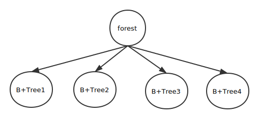

## Index Manager
### 总述
Index Manager负责B+树索引的实现，实现B+树的**创建和删除**(由索引的定义与删除引起)、**等值查找、插入键值、删除键值**等操作，并对外提供相应的接口。
B+树中节点大小应与缓冲区的块大小相同，B+树的叉数由节点大小与索引键大小计算得到。

### 主要功能接口
#### `createIndex`
- 本函数被调用于create index语句之中，其具体作用是**创建一个文件**，将用于保存该索引的数据，同时，本函数还将自动插入该表现存数据的索引内容。
- 传入参数
  - 索引名
  - 表名
  - 列序号
- 返回结果
  - 创建成功与否
#### `dropIndex`
- 本函数被调用于drop index语句之中，其具体作用是**删除该表的数据文件**，同时也清空该索引在内存中的数据
- 传入参数
  - 索引名
- 返回结果
  - 删除成功与否
#### `insertIndex`
- 本函数被调用于insert values语句之中，其具体作用是在**B+Tree之中插入一条内容**(键，键值)。
- 传入参数
  - 表名
  - 键 (该字段的内容)
  - 键值 (该字段所对应行的行序号)
- 返回结果
  - 插入成功与否
#### `select`
- 本函数被调用于select语句之中，其具体作用是在该表的索引之中**使用等值查询**，查找符合给定条件的一条内容，随后进行**project**。
- 传入参数
  - 索引名
  - 字段列表
  - 等值查找的待查找值
- 返回结果
  - 仅有一个元素的二维数组(为了与非索引查找的结果结构保持一致)，即为等值查找的结果。
#### `deleteIndex`
- 本函数被调用于delete语句之中，其具体作用是**删除该索引对应的B+Tree之中符合给定条件的所有数值及其键值**。
- 传入参数：
  - 索引名
  - 待删除的键的列表
- 返回结果
  - 删除的成功与否
### 数据结构
#### `forest`
此变量为**所有B+Tree的集合**，用python 字典(hash table)的方式存储，查找方式为使用`indexName`作为key进行O(1)时间复杂度的查找

B+Tree索引结构请参见B+Tree模块的报告
### 实现思路及算法
#### `createIndex`
- 基本思路为根据所传入的索引名名，**新建一个空的文件**，用于保存B+Tree索引数据
- 实现方法：
  - 新建文件：新建空文件的方法为调用buffer manager的`write`，**写入一个零长度的`b''`内容**，则buffer manager会自动创建一个空文件
  - **导入表中已有数据**：待导入数据的格式为二维数组[(key,value)]获取key的方法为遍历整个已有的表，value的方法可以通过`recordManager.selectWithNo`方法获取该key所对应的行序号，然后通过`sorted`方法将待插入的数据用key的升序预先排好，之后通过B+Tree的`bulkload`方法快速导入至B+Tree
#### `dropIndex`
- 基本思路是直接**删除所传入的表名所对应的数据存储文件**。
- 实现方法：通过调用buffer manager所提供的`delete`方法，删除某个文件，并且清除该文件在内存区的buffer内容
#### `insertIndex`
- 基本思路是将传入的一行索引数据(key,value)插入至B+Tree
- 实现方法
  - 直接**调用B+Tree的`insert`方法**插入B+TreeNode至B+Tree
#### `select`
- **基本思路找到该索引对应的B+Tree，然后通过B+Tree的查找方法快速找到结果所在的行序号，然后通过行序号定位其在原文件之中的所在位置，读取并返回**
- 实现方法：
  - 调用B+Tree的`get`方法找到该值所在的行序号，然后通过行序号与表大小与块大小的计算，得出该值所在的位置（在文件中的第几个bytes），如果valid，则返回，否则则返回空结果
#### `deleteIndex`
- 基本思路是**删除B+Tree对应节点的数据**，每次调用只能删除ee一个
- 实现方法是直接调用B+Tree的`delete`方法，删除该行对应字段上的内容
