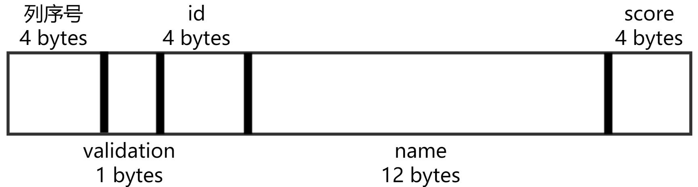

## Record Manager
### 总述
Record Manager负责管理记录表中数据的数据文件。主要功能为实现数据文件的**创建与删除(由表的定义与删除引起)、记录的插入、删除与查找操作**，并对外提供相应的接口。
本模块可以实现的查找操作类型有
- 不带条件的查找
- 带条件的查找，包括单条件查找和双条件查找，其中以and连接两个条件。支持的条件类型如下：
  - 等值查找(=)
  - 不等值查找(<>)
  - 区间查找(> , <, <=, >=)
    本模块支持的数据类型有
- int， 即32位整数型
- float， 即32位单精度浮点型
- char(n)， 即自定义定长的字符型(其中n>0)
  本模块的数据文件保存方式为二进制单文件（每个表单独一个文件），使用buffer manager进行文件的分块单独操作，不支持一条记录的跨块存储。
### 主要功能接口
#### `createTable`
- 本函数被调用于create table语句之中，其具体作用是**创建一个文件**，将用于保存该表的数据
- 传入参数：
  - 表名
- 返回结果
  - 创建成功与否
#### `dropTable`
- 本函数被调用于drop table语句之中，其具体作用是**删除该表的数据文件**，同时也清空该表在内存中的数据
- 传入参数：
  - 表名
- 返回结果
  - 删除成功与否
#### `insert`
- 本函数被调用于insert values语句之中，其具体作用是在该表之中**插入一行内容**。
- 传入参数：
  - 表名
  - 一行数据内容
- 返回结果
  - 插入成功与否
#### `select`
- 本函数被调用于select语句之中，其具体作用是在该表之中**查询符合给定条件的所有内容**(select)，并且可以选择只返回其中的某些字段内容(project)，此外还可以根据给定的字段进行升序排序，也可以限制最大输入的行数。
- 传入参数：
  - 表名
  - 选择project哪些字段(默认为全选)
  - 根据哪些条件进行查询(默认为无条件查询)
  - 按哪一列排序(默认为不排序)
  - 限制输出的行数(默认为不限制)
- 返回结果
  - 选择的结果，以二维数组的格式返回，每一行为表中的一行数据
#### `delete`
- 本函数被调用于delete语句之中，其具体作用是**删除该表之中符合给定条件的所有内容**。
- 传入参数：
  - 表名
  - 根据哪些条件进行删除(默认为全部删除)
- 返回结果
  - 删除的行数
### 数据结构
#### 表内容的存储
- **表内容为定长存储，每一行内容严格按照`catalogManager`中给定的表大小存储，行与行之间的内容无分隔符号。**
- 以表`studeng2`为例
  
- 首先是附加属性`行序号`，表示这一行是全表的第几行。使用32位整数类型存储。
- 接下来是附加属性`validation`，表示这一行内容是否有效（如果被删除则为无效），使用bool类型存储
- 以下是表的正式内容，第一个为`id`，使用32位int类型存储(4 bytes)
- 第二个为`name`，使用12个8位char类型存储(12 bytes)
- 第三个为`score`，使用32位float单精度浮点类型存储(4 bytes)
- 因此，上述表的每行总大小为4+1+4+12+4=25 bytes，按照buffer manager 的每块大小为4096 bytes计算，每个block可以存放163行记录
### 实现思路及算法
#### `createTable`
- 基本思路为根据所传入的表名，**新建一个空的文件**，用于保存数据
- 实现方法：新建空文件的方法为用过buffer manager，写入一个零长度的`b''`内容，则buffer manager会自动创建一个空文件
#### `dropTable`
- 基本思路是直接**删除所传入的表名所对应的数据存储文件**。
- 实现方法：通过调用buffer manager所提供的`delete`方法，删除某个文件，并且清除该文件在内存区的buffer内容
#### `insert`
- 基本思路是将传入的一行数据**检查重复性**(primary key&unique key)，再内容转化为对应的二进制表示，并且写入在数据文件的末尾
- 实现方法：
  - 检查重复性：调用select语句，查询该primary key, unique key**是否已经存在结果**，如果存在，则报重复错，如果不存在，则继续后续进程
  - **转化为二进制**：
    - `行序号`,首先根据数据文件的大小可以直接计算得当前已存在的数据量，以改数字为行号，通过`struct.pack('i',no)`则可以将int类型的no转化为4 bytes的二进制表示
    - `validation`，默认为`b'\x01'`，即有效
    - 对于每一个字段的数据，首先调用catalogManager中的`getFieldsList`方法获取该字段的类型，然后调用`struct.pack('i',intData)`,`struct.pack('i',floatData)`或`str.encode(string)`转化为对应二进制表示
  - 然后**计算存放于文件的位置**，首先根据数据文件的大小可以直接计算得当前已存在的数据量，由于是数据定长存储，可以在O(n)时间复杂度下计算获取该写入的block序号，然后**写入到当前内容的尾部**(如果该块剩余空间不足，则填充`b'\x00'`至当前块满，然后将真正内容写入到下一块的首部)
#### `select`
- 基本思路是**遍历该表的每一列**，对于每一个条件都进行判断，只有**同时满足所有条件才可以加入到最终结果的数组之中**，随后进行**排序操作**，之后进行**project操作**，选择需要的字段，然后返回所得结果的前limit列。
- 实现方法：
  - 如果筛选条件满足**使用索引的条件**(等值查找，有索引)，则调用index manager的查找方法，时间复杂度为O(logN),否则，则使用遍历查找的方法，复杂度为O(N)
  - **遍历**方法：遍历该文件的每一个block，对于每一个block，按照表大小、字段类型定义进行二进制解码
    - 解码方式：
      - 首先根据该条记录的第五个byte(validation)判断，如果为False，则跳过
      - 如果为True，则对后续的二进制内容进行解码,解码方式为`struct.unpack()`,可以将二进制内容转化为对应类型的python内置类型
  - **判断**满足条件的方法：先将条件和内容连接至一个字符串之中，然后调用`eval()`对该字符串表示的逻辑表达式进行判断。
  - **排序**方法：对于筛选后的数组，使用`sorted(list,key=lambda record: record[orderedBy])`对给定数组，用数组中的第`orderedBy`个元素进行升序排序。
  - **project**方法：因为之前所得到的数组是包含所有字段的信息的，因此我们新建了一个新数组，对于原数组中的每一个元素，只将所需要的字段重新拷贝只新数组。
  - 返回前limit个数据的方法：直接返回新数组的[0:limit]的slice
#### `delete`
- 基本思路是先**查询**，然后对查询到的结果，将其`validation`信息**改为not valid**,并且对删除的数量进行计数
- 实现方法：
  - 查询方法与`select`完全相同，此处不再赘述
  - 删除方法为对每一个符合删除条件的内容，将其数据文件中的第5个byte`validation`改为False(二进制为`b'\x00'`)。并且对计数器+1
