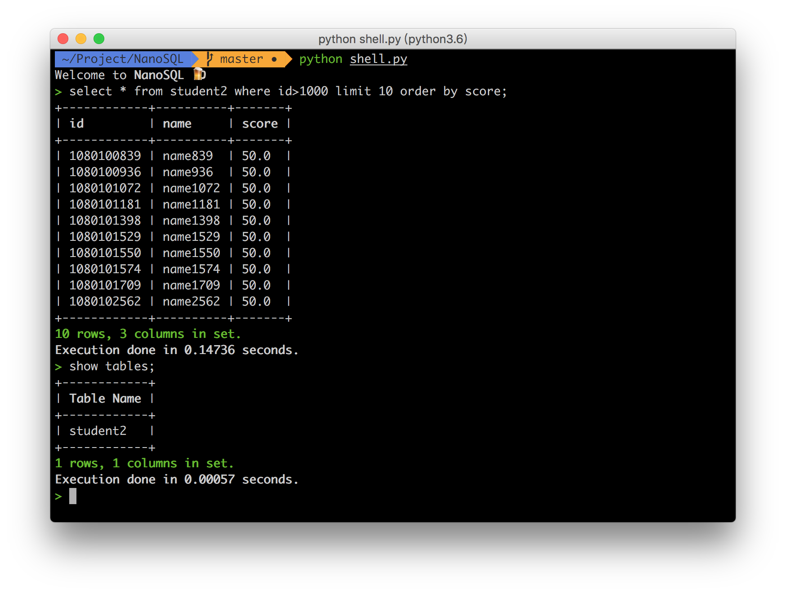
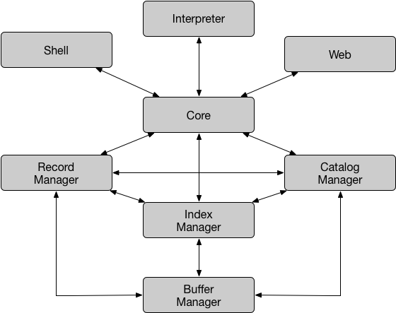

# MiniSQL实验报告

3150104894 李海鹏

3150104785 郝广博

## 项目概况



`NanoSQL`是我们使用Python语言开发的一个简易的数据库系统，支持基本的SQL操作，shell交互，图形界面访问。

项目地址：[GitHub](https://github.com/awmleer/NanoSQL)

## 分工

| 模块             | 负责   |
| -------------- | ---- |
| shell          | 郝广博  |
| interpreter    | 郝广博  |
| core           | 郝广博  |
| indexManager   | 李海鹏  |
| BPlusTree      | 李海鹏  |
| catalogManager | 李海鹏  |
| recordManager  | 李海鹏  |
| bufferManager  | 郝广博  |
| web            | 郝广博  |

## 架构说明

首先需要说明的是，我们并未完全按照实验指导书提供的模式去设计这个系统，而是自己做了一些架构上的调整。



用户和数据库系统的交互方式有两种，一种是通过shell，另一种是通过web页面，无论是那种方式，交互模块（`shell`或者`web`）所做的事情就是：把用户输入的SQL语句传送给`core`模块，把`core`返回的SQL执行结果显示给用户。

我们把`interpreter`和`core`模块独立出来了，`interpreter`只做SQL语句的解析，通过正则表达式将其解析为字典。在`core`模块拿到SQL语句后，首先通过interpreter做解析，然后再根据解析结果做分发调用。

三大数据处理模块`recordManager`、`catalogManager`、`indexManager`除了均和`core`模块、`bufferManager`有交互之外，它们之间也有少量的交互。


```
TODO
这里是各个模块的分别介绍
```


## 有待提高的地方


## 个人感悟

郝广博：

> 虽然NanoSQL远不能达到工业应用的标准，但麻雀虽小五脏俱全，我们在设计和制作它的过程中，体会到了数据库系统的各个模块是如何进行配合、交互的。