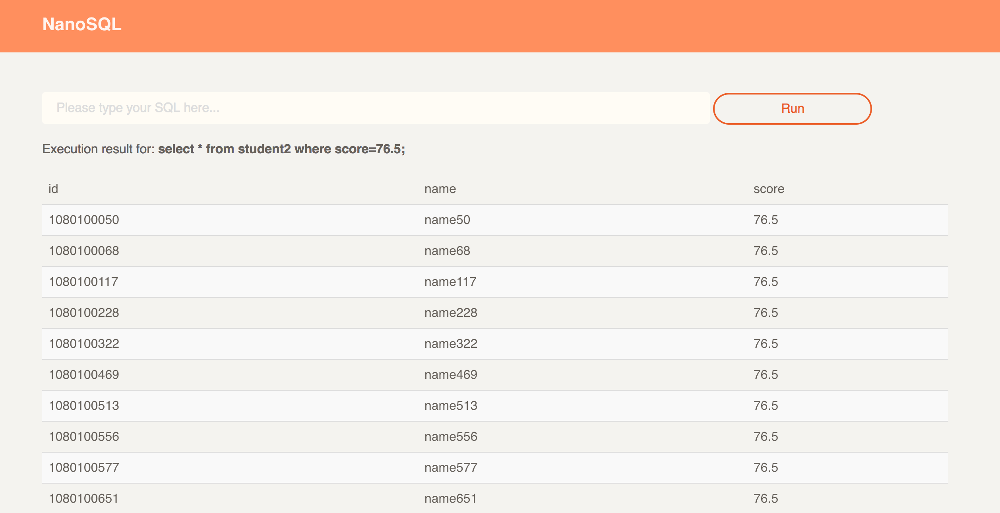
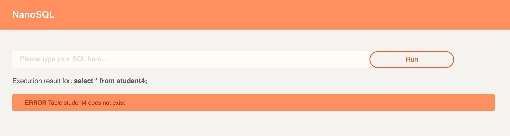

## Web

这个模块是利用[flask](http://flask.pocoo.org/)框架，搭建了一个非常简易的web服务器，从而给用户提供了图形化的交互界面。

由于这些知识（如http请求的处理、路由配置、模板渲染等等）并不属于数据库系统的范畴，所以这里不再阐述。

在web模块中，并没有做任何SQL语句的处理，而是转交给core模块去做处理。web模块只负责处理和界面相关的逻辑。